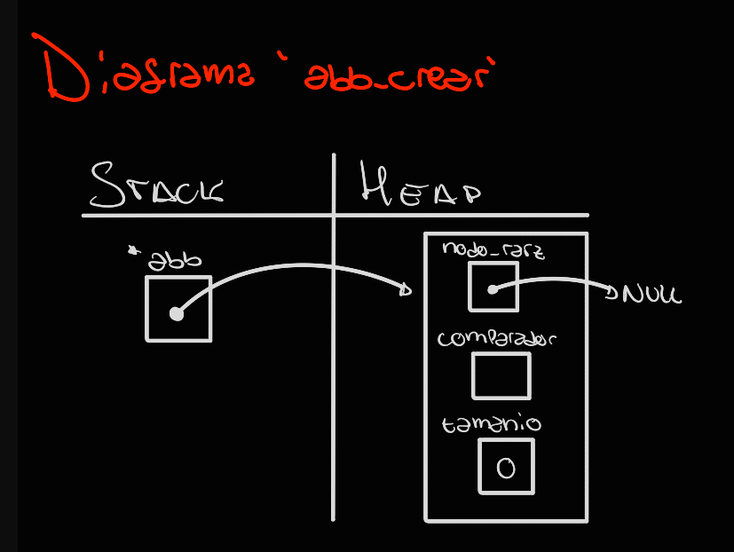
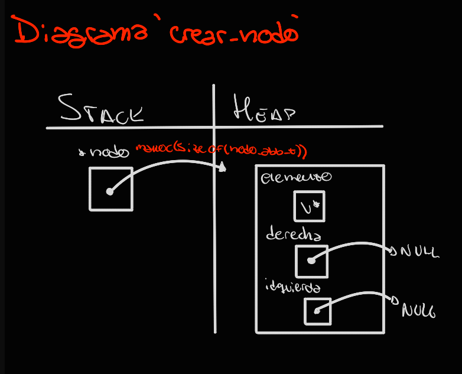
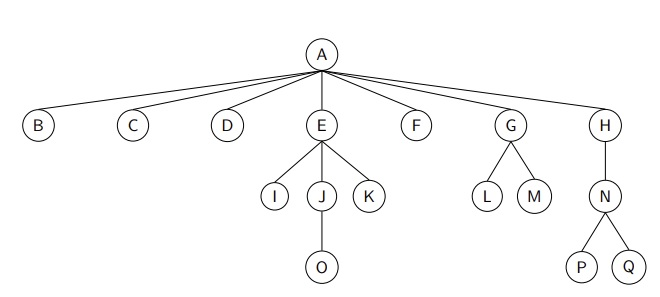
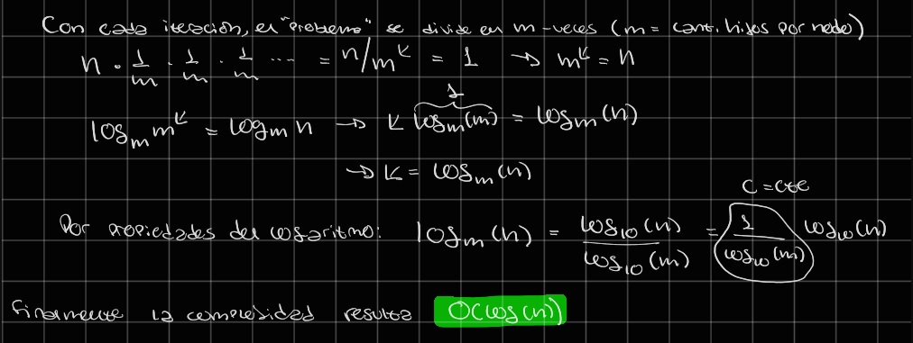

# TDA ABB

## Repositorio de (Nombre Apellido) - (Padrón) - (Mail)

- Para compilar:

```bash
Línea de compilación pruebas cátedra: gcc -std=c99 -Wall -Wconversion -Wtype-limits -pedantic -Werror -O2 -g src/*.c pruebas_chanutron.o -o pruebas_chanutron
Línea de compilación pruebas alumno: gcc -std=c99 -Wall -Wconversion -Wtype-limits -pedantic -Werror -O2 -g src/*.c pruebas_alumno.c -o pruebas_alumno
```

- Para ejecutar:

```bash
Línea de ejecución pruebas catedra: ./pruebas_chanutron
Línea de ejecución pruebas alumno: ./pruebas_alumno
```

- Para ejecutar con valgrind:

```bash
Línea de ejecución con valgrind pruebas cátedra: valgrind --leak-check=full --track-origins=yes --show-reachable=yes --error-exitcode=2 --show-leak-kinds=all --trace-children=yes ./pruebas_chanutron
Línea de ejecución con valgrind pruebas alumno: valgrind --leak-check=full --track-origins=yes --show-reachable=yes --error-exitcode=2 --show-leak-kinds=all --trace-children=yes ./pruebas_alumno
```

---

## Funcionamiento

Las estructuras desarrolladas en el TP se basan en un ARBOL DE BÚSQUEDA BINARIO (ABB).

En un principio, se crea un árbol mediante la función `abb_crear`, cuyo proceso de ve representado en el siguiente esquema:



A partir del árbol creado se pueden realizar diversas operaciones, siendo algunas de estas recursivas, y otras iterativas. En fin, las operaciones disponibles a realizar son: crear un árbol, insertar elementos en el árbol, quitar elementos del árbol, buscar elementos dentro del árbol, verificar si el árbol está vacío, obtener el tamaño del árbol, recorrer el árbol segun el recorrido especificado (INORDEN, PREORDEN, POSTORDEN) aplicando una función particular a cada uno de los elementos del árbol, recorrer el árbol segun el recorrido especificado y almacenar los elementos del árbol en un array.

Para la inserción de elementos al árbol se utiliza la función `crear_nodo`, cuyo proceso de utilización de memoria se ve representado en el siguiente esquema:



A la hora de insertar elementos al árbol, se tiene en cuenta que el mismo permite elementos repetidos, tomando la convención en que si el elemento a insertar es menor o igual respecto del cual se está realizando la comparación, se insertará a la izquierda, y en caso que sea mayor, a la derecha.

Otra consideración que se tomó en el desarrollo del TP, es que a la hora de eliminar un elemento de un nodo con dos hijos, el mismo se sustituirá por su PREDECESOR INORDEN.

Por otro lado, la función `abb_con_cada_elemento`, posibilita recorrer el árbol según el recorrido indicado, siendo las opciones INORDEN, PREORDEN y POSTORDEN. A medida que se recorre el árbol, se le aplica a cada elemento del mismo la función que se indica en el parámetro de la llamada.

Y por úlitmo, la función `abb_recorrer`, posibilita copiar los elementos del árbol deseados a un vector, recorriéndolo según el recorrido indicado, teniendo las opciones de recorrido mencionadas.

---

## Respuestas a las preguntas teóricas

Incluír acá las respuestas a las preguntas del enunciado (si aplica).

    qué es un arbol

arbol binario de busqueda sigue una serie de convenciones para tener una organización estructurada del árbol, se tiene una convención de orden. en este caso menorez a izq y mayores a der.

- Explique teóricamente qué es una árbol, árbol binario y árbol
  binario de búsqueda. Explique cómo funcionan, cuáles son sus operaciones básicas
  (incluyendo el análisis de complejidad de cada una de ellas) y por qué es
  importante la distinción de cada uno de estos diferentes tipos de
  árboles. Ayúdese con diagramas para explicar.

Un árbol es en principio una colección de nodos, siendo estos los elementos del árbol. Un árbol está formado por un nodo raíz, y cero o muchos subarboles, a los cuales el nodo raíz se conecta mediante punteros:



Empezando por el nodo raíz, este puede tener N cantidad de nodos hijo, los cuales serán aquellos a los que este tenga acceso. En el caso de la imágen anterior, A sería el nodo raíz de todo el árbol y B, C, D, F, G, y H serían sus hijos. Además, se observa que por ejemplo E es el nodo raíz de su subárbol, teniendo como hijos a I, J y K.

Existe varios de tipos de árbol, los cuales se basan en la estructura mencionada. Por ejemplo, un árbol binario es aquél árbol cuyos nodos tienen exclusivamente dos nodos hijos, sean vacíos o no. Y aún más, un árbol binario de búsqueda, es un árbol binario que además adopta alguna convención de organización para los elementos almacenados. En este sentido se logran establecer pautas que posibilitan realizar operaciones con el mismo de manera mucho más eficiente.

Su funcionamiento se basa en algunas operaciones básicas, siendo estas ingresar elementos al árbol, quitar elementos del árbol, buscar elementos en el árbol y recorrer el árbol.

Para la inserción de elementos se suelen adoptar convenciones según la implementación desarrollada. Por ejemplo, se puede tomar el caso en que, teniendo un elemento a insertar, si este es menor o igual al elemento del nodo que se está comparando, se continuará con la inserción por el hijo izquierdo, mientras que si es mayor, por el hijo derecho. Y en caso de que el nodo con el que se esté comparando esté vacío, se insertará en el mismo.

En cuanto a la complejidad computacional de esta operación, se puede realizar el siguiente análisis. Teniendo en cuenta la estructura del árbol, en que a medida que se baja por sus niveles se está dejando de lado el resto de los subarboles del mismo, esto significa que con cada iteración que se realiza se reduce la complejidad del "problema" en n/M, siendo M la cantidad de hijos que tienen los nodos del árbol. Por esta cuestión, si se aplica el siguiente razonamiento del esquema, resulta que la complejidad computacional promedio de esta operación resulta: O(log(n)). El hecho de que se considere la complejidad promedio, es porque los árboles no siempre van a estar perfectamente "balanceados", significando que no siempre en cada iteración se va a reducir el problema de igual manera. Pero para definir esta complejidad se tomó en cuenta un árbol balanceado, ya que sino, en el peor de los casos el árbol se habría transformado en una lista, haciendo que la complejidad de inserción sea O(n).



Luego, para quitar elementos se plantean tres situaciones particulares, donde el proceso de eliminación varía dependiendo de la cantidad de hijos que tenga el nodo en que se encuentre el elemento a eliminar. En caso que el nodo a eliminar no tenga ningún hijo, simplemente se elimina el elemento y se libera la memoria utilizada por el nodo. Si el nodo a eliminar tiene un único hijo, se elimina el elemento deseado, y este se reemplaza por el elemento del único hijo, para luego eliminar y liberar el espacio del mismo. Finalmente, si el nodo en que se encuentra el elemento a eliminar posee más de un hijo se suelen tomar dos caminos para reemplazar el valor y no tener que hacer un reordenamiento del mismo. El elemento a eliminar se puede reemplazar por el predecesor inorden o el sucesor inorden del mismo. Nuevamente, si se aplica el razonamiento mostrado en la explicación de insertar, la complejidad promedio de quitar un elemento de un árbol resulta O(log(n)).

Asimismo, la operación de búsqueda igualmente se asemeja a las operaciones ya mencionadas en el sentido en que ambas utilizan el mismo desarrollo lógico que el de búsqueda de elementos, simplemente agregando pasos en medio. Así, buscar un elemento conlleva recorrer el árbol a medida que se compara el elemento del nodo visitado con el buscado, para detectar cuando el buscado se encuentra en el árbol y cuando no existe en el mismo. En cuanto a la complejidad, también resulta en promedio O(log(n)), al ser la complejidad que conlleva acceder a los elementos del árbol, al igual que lo son las complejidades de insertar y quitar elementos.

Por último, en cuanto a la operación de recorrer el abb, teniendo en cuenta que se deberán realizar N operaciones para recorrer todos los elementos del mismo y asumiendo que en el medio se realizan instrucciones O(1) al llamar a la función pasada por parámetro a la función `abb_con_cada_elemento` (que en este caso copia el elemento actual en un vector), la complejidad que resulta tener es O(n). Su funcionamiento es principalmente recorrer todo el abb pasando por cada uno de sus elementos. Ahora bien, esta acción depende del recorrido indicado, pudiendo este ser INORDEN, PREORDEN o POSTORDEN.

- Explique su implementación y decisiones de diseño (por ejemplo, si
  tal o cuál funciones se plantearon de forma recursiva, iterativa o
  mixta y por qué, que dificultades encontró al manejar los nodos y
  punteros, reservar y liberar memoria, etc).

En la implementación tomada, las funciones de insertar, quitar, buscar, destruir y recorrer el árbol se realizaron con un planteo recursivo de desarrollo, debido a que en gran parte esta implementación resultaba más comprensible que la forma iterativa, al facilitar la descomposición de cada operación en problemas menores y el extensivo trabajo con punteros.

La principal dificultad encontrada durante el desarrollo del árbol, fue el manejo de nodos y sus punteros, ya que en un principio fue difícil relacionar cada "return" de las funciones con la reasignación de punteros. En cambio se intentó encarar el problema tratando de localizar el nodo anterior al del elemento para poder realizar la reasignación de punteros, pero no resultaba eficiente y abría muchos más casos particulares. Luego se pudo implementar el desarrollo recursivo aprovechando tal planteo para la reasignación de punteros.
